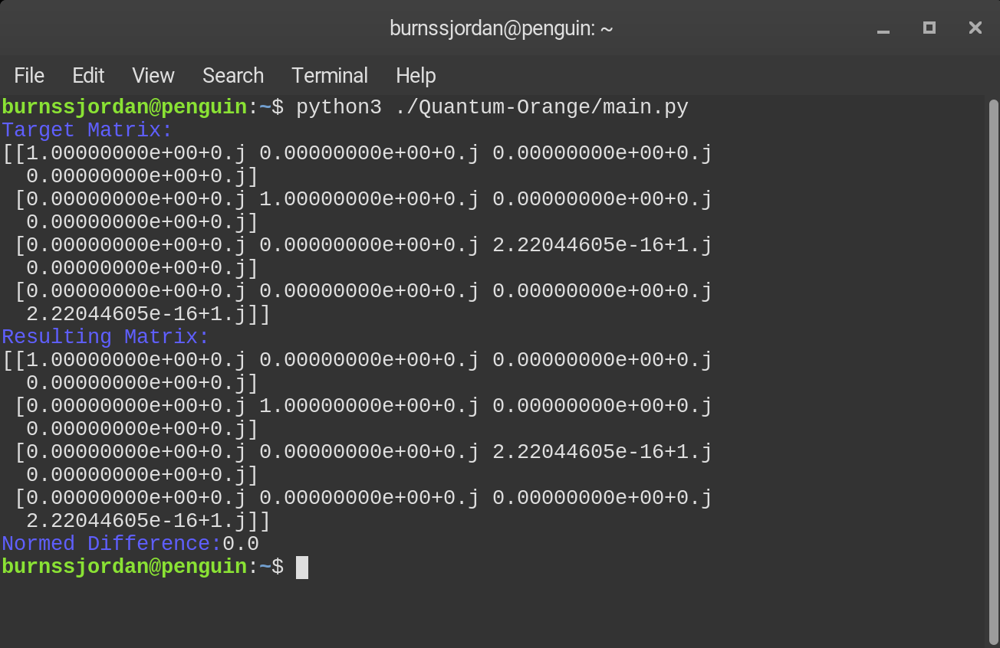
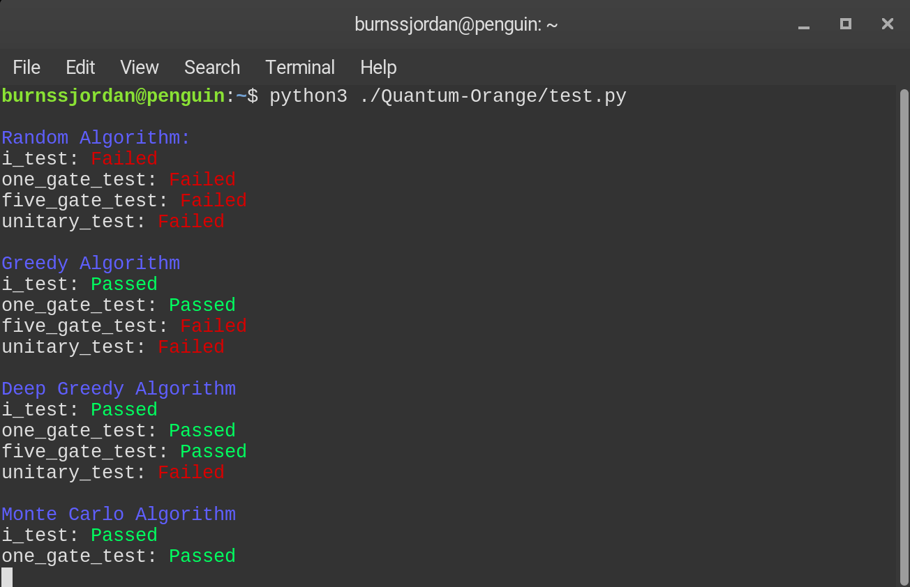

# Quantum-Orange
Quantum-Orange is a tool that attempts to approximate an arbitrary unitary matrix using a small number of 'gates'. This would allow for the approximation of this matrix on a quantum computer.

**This is a research project in the early stages of development and will change a lot.**
# Usage
## main.py
This file attempts to approximate the given target matrix using the specified algorithm and configuration. Currently the settings can only be changed in the file but command line options will be added later.

`python3 main.py`

## test.py
This file runs all the algorithms through a series of tests and outputs the results.

`python3 test.py`

